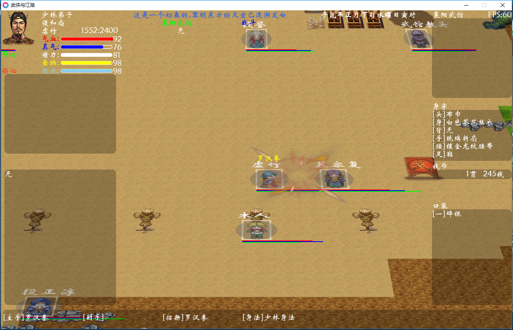

# 武侠与江湖 love2d 版
欢迎大家来到《武侠与江湖》，
先前用LibGDX游戏框架做的武侠沙盘角色扮演类游戏，
后来在考虑任务脚本时候，发现lua上的一个love2d引擎，简单好用
就着手学习lua 和 love2d ，同时把项目搬到这里，原来的应该也不会放弃
love2d 主要用作建立模型。

## 游戏主题
穿越到武侠的年代，想办法在新的环境中生存下去。吃喝嫖赌、琴棋书画。成为一代侠之大者，或者富甲天下，或者结交好友纵意江湖~~

## 游戏特点
丰富的人物属性需求、错综复杂的武侠世界、丰富多彩的武功秘籍、封闭式的生产销售经济系统、随机的人物关系、充满变数的江湖。
PS:上面这些都是想法，还没实现。

## 游戏参考
* 游戏风格。大灾变CDDA http://en.cataclysmdda.com/ 里面的生存，开发，所以，画面估计就那样，游戏性比不上人家，自己能玩的乐在其中就行了。
* 人工智能。矮人要塞DF http://www.bay12games.com/dwarves/ 里面的AI与历史，随机世界。当然了，自己的水平暂时还开发不出来，所以打算把AI部分做成开放的脚本，谁喜欢谁设计去。
* 游戏数据。数据方面呢，现在很多都是搜集的网络上的，后期会逐步变成自己的。 目前的元素主要是 武功、护甲、食物、食材等。

## 游戏素材
目前用的网上搜集的各种素材，后期将逐步转为自己的素材。

## 进度截图

## 下一步计划
- [ ] 用脚本控制npc的基本行动 思路：与决策树同步考虑
- [ ] 为npc建立状态机     思路：后续扩展可能困难，学习决策树中。
- [ ] 建立任务系统        思路：采取勇者斗恶龙的支线剧情方式。小剧本，平衡到每个角色。
- [ ] 建立基本的战斗系统     目前：基本的战斗数据已经有了
- [ ] 剧情测试          思路：有难度，暂时不会深入考虑
- [ ] 物品的装备     目前：已经可以基本的换装，装备属性还在设计中
- [ ] 物品的使用     目前：基本的吃饭和茶水已经可以

## 近期工作
1. 整理数据，目前已经整理药材、屠宰
2. 数值设计，参考龙与地下城规则，最终幻想，浪漫沙加等游戏，设计战斗数值，进展缓慢
3. 战斗模拟，基本的模型已经有，图中不同的线条，表示气血、真气、精力，透明圆表示真气护体，当真气为0时，护盾消失
4. 各种机制，各类小游戏已经有大体框架，例如音律，打猎，炼丹，制药等

各项机制越来越清晰，加油！！ 争取年底前出个demo版！！
