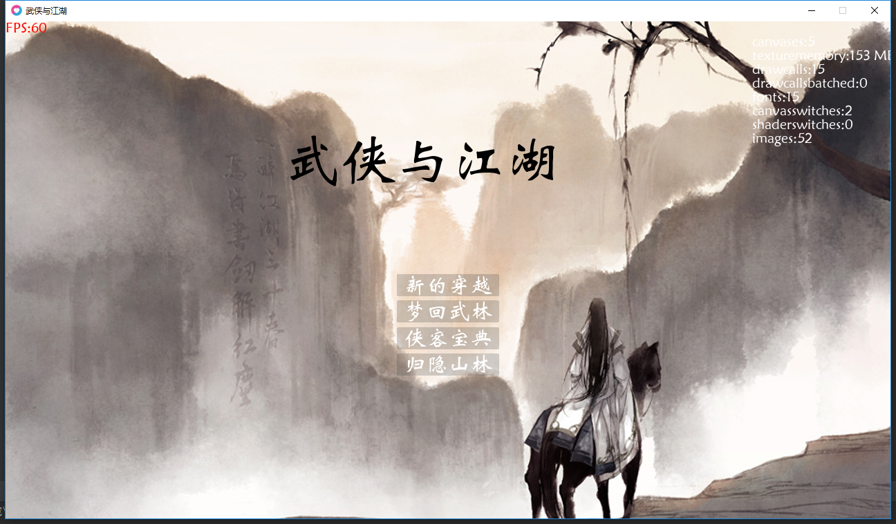
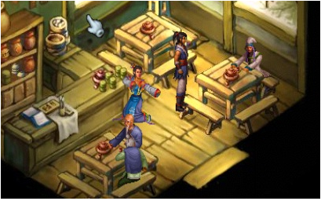
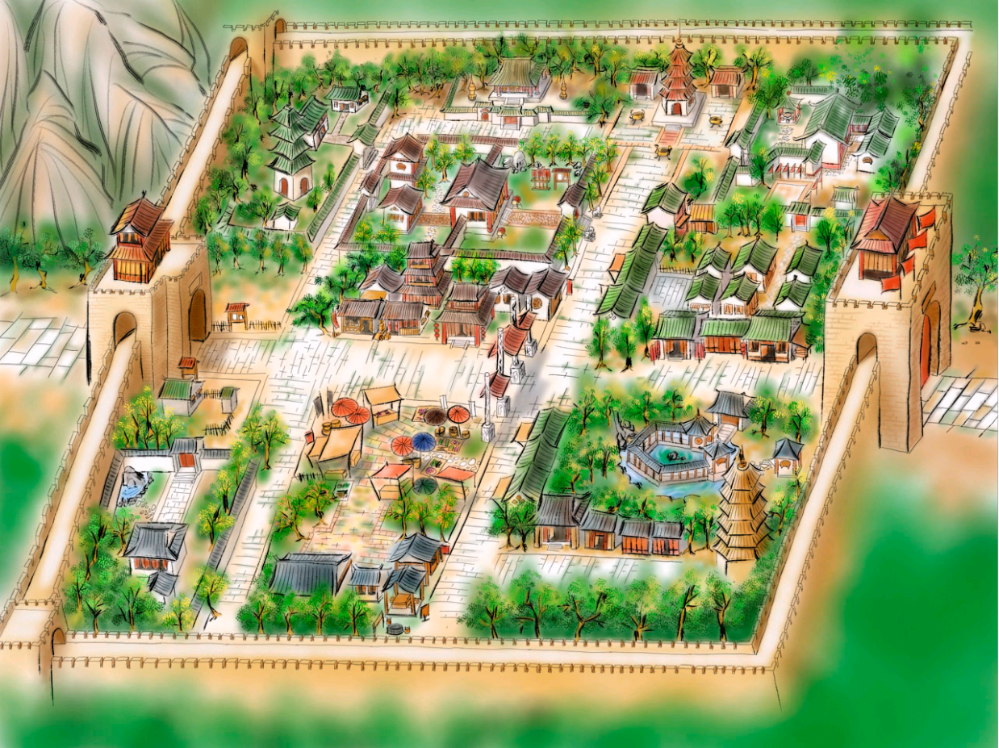
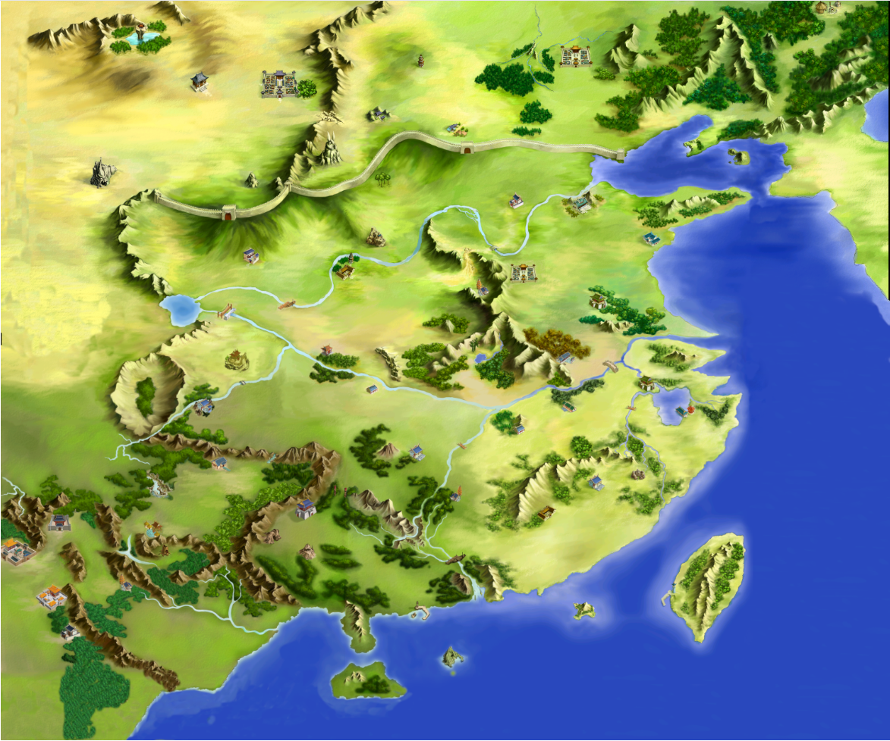
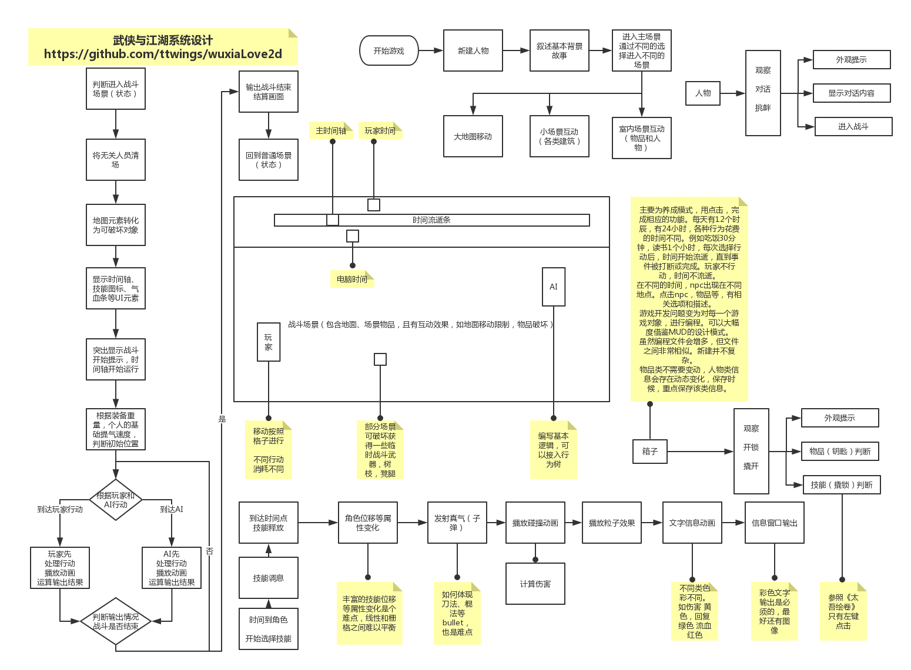
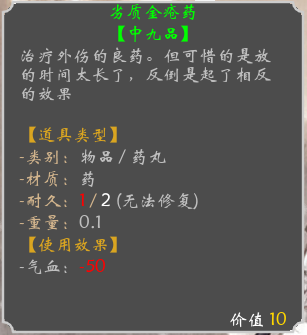

# 武侠与江湖

* 目标平台：steam、ipad、android pad
* 目标受众：武侠养成游戏爱好者
* 目标分级：E 10+
* 预计发行：待定n年后

## 剧情和玩法
* 穿越到武侠的年代，想办法在新的环境中生存下去。
* 吃喝嫖赌、琴棋书画、士农工商、木工铁匠、织锦巧手。
* 成为一代侠之大者、或者富甲天下、或者结交好友纵意江湖~~

## 游戏流程
* 新建人物，基本属性，技能，喜好，性格
* 开始，穿越到某个地方，逐步适应古代的生活，学习基本生活技能
* 发展，拜师学艺，锻炼自己，寻找生活的意义。是找到回去之路，还是在古代好好享受生活
* 结局，n年之后，回忆......

## 角色和操作
* 你是一个现代人，穿越到了一个古代世界，试着了解这个世界，生存下去吧。
* 在城镇地图，通过点击进行查看探索对话，了解这个镇子。
* 进入各种房间，通过点击，与物品人物互动。接受任务。
* 探索地图，参与各种小游戏（钓鱼，砍柴，除草，切菜，炒菜，跳桩，躲避，打猎，弹琴），寻找完成任务的方式。
* 展示物品，选择见闻，完成任务。
* 进入战斗，选择指令或招式，角色根据指令行动。（不需要控制移动，角色根据武功招式，自行移动，增加不可控变数，参考sfc《星海传说》）
* 所有操作，都可以通过点击完成，用手柄可以快速在选择中切换。

## 主要玩法
* 玩家要扮演自己，穿越到古代，或成为侠客、或成为商贾、或成为官员等
* 初始穿越，逐步了解这个地区的情况，拟定一条自己的生活路线
* 按照时间，安排自己的一天。每天就是n个时辰的回合，子、丑、寅、卯、辰、巳、午、末、申、唒、戌、亥
* 如卯时，酒店选择帮厨，提升自己的酒艺，同时能听到一些趣闻。
* 特定时间，特定地点，会出现一些特殊人物，可以带你改变命运，你可以选择入不同的门派学艺，也可以选择其他。
* 从初始的穿越点，来到新的地方，熟悉并学艺（小游戏形式），期间会有一些剧情任务，需要你做出选择和处理（通过你的属性和性格提供选项），同时你能认识更多的人（人与人之间关系复杂）。
* 学艺大成之后，可以选择自己的目标（富甲天下、华山论剑、神仙眷侣、位极人臣等等），用自己特有的方法，独自闯荡江湖，或结交俩三个好友，或结识伴侣，探索这个世界，发掘出各种故事，完成自己的目标。
* 目标完成，可以选择继续，可以选择回忆这一段旅程。

## 游戏世界
* 虽然为架空世界，但计划以宋代为基本背景，各个年代图书、字画、古董、美食穿插其中，游戏中领略古代文化。
* 从一个小地方探索，到城镇、在到整个国家的探索。视野逐步开阔。

* 目前采用《武林群侠》和《天龙八部》游戏图做测试，后续会改为像素风格。

## 游戏界面
* 简单流程图

* 物品信息

* 旧版战斗

## 游戏特点
* 丰富的人物属性需求
* 错综复杂的武侠世界
* 丰富多彩的武功秘籍
* 经济系统

## 敌人和BOSS
* 野外冒险，遇到的各类野兽
* 随机事件，遇到的各种恶人
* 不同势力间的比拼
* 因为事件与各种npc接下的仇怨，npc会想办法收拾你。。。失败了，下一次会更努力，更厉害。
* 因为事件影响到了某个势力的利益，会派各类人员来，直到大BOSS，除非你妥协。反复会更让势力恼怒。

## 游戏参考
* 游戏风格。大灾变CDDA http://en.cataclysmdda.com/ 里面的生存，开发，所以，画面估计就那样，游戏性比不上人家，自己能玩的乐在其中就行了。
* 人工智能。矮人要塞DF http://www.bay12games.com/dwarves/ 里面的AI与历史，随机世界。当然了，自己的水平暂时还开发不出来，所以打算把AI部分做成开放的脚本，谁喜欢谁设计去。
* 游戏数据。数据目前以武侠MUD 侠客行100为基础学习制作

## 游戏风格
* 图像风格，目前采用像素2D风格（后期可能会变为2.5D像素风格），rpgmaker类，网上收集的中国风tile资源
* 背景音乐，目前采用几个经典的武侠游戏音乐，如《金庸群侠传》、《武林群侠传》、《剑侠情缘》等
* 战斗音效，目前主要采用《金庸群侠传》战斗音效
* 目前用的都是网上搜集的各种素材，后期将逐步转为自己的素材。

PS:近期学习GODOT. 项目在godot上实现中. 近期github上找到 mud xkx100资源,以侠客行为基础数据,学习重构中. MUD侠客行里面有大量信息可供学习.在抄袭的过程中,转为godot项目.如果可能,会做成开源网络版,方便大家一起游玩.

## 下一步计划
- [x] 重构整体框架。 整体框架参考学习MUD侠客行.
- [X] 用脚本控制npc的基本行动 思路：与决策树同步考虑，没有太多细节移动，直接场景切换
- [X] 为npc建立状态机   不考虑复杂情况,只用简单的状态机。
- [x] 建立任务系统      基本任务系统已经测试
- [X] 建立基本的战斗系统     目前：不单独建立，直接进入游戏中测试，单独设置战斗场景。
- [x] 剧情测试          思路：弱化任务剧情,不强制推剧情,休闲游戏.凸显武侠文化氛围为主.
- [X] 物品的使用     目前：基本的吃饭和茶水已经可以
- [x] 制作出"长安"地图
- [ ] "长安"地图,配套人物,物品,房间功能添加(进行中)
- [ ] 完善基本游戏循环,新建人物,读取信息
- [ ] 完成基本逻辑 出生"长安",在长安打工生存,拜师,学习技能

## 近期工作
1. 整理数据，全部数据以MUD侠客行100为基准,后期调整
2. 数值设计，数值采用MUD侠客行100,降低各项经验等级等.初步计划100级.相当于100年.与人的寿命挂钩.
3. 战斗模拟，调整基本的战斗模式,参考手游<放置江湖>和<太吾绘卷> 战斗风格,回合制,尽力增加策略性.比如预先计划出招.
4. 各种机制，各类小游戏目前采用侠客行100.暂以文字解密类为主.后期利用godot的优势,培独立的游戏场景.

不断砍砍砍，将各项机制，砍到最低限度，以做出来，为第一要务。
1、地图只有一张 扬州 城，为地图添加部分物品。(0%)
2、菜单就目前这种，设置部分弹出菜单(10%)
3、完善战斗，以回合制为基础，战斗动画效果采用<放置江湖>风格,战斗模式在mud基础上修改.动画自己临摹.顺道学习像素绘图.(10%)
4、完善对话，基本的对话，与接任务，交任务挂钩.(10%)
5、任务，多种任务，如锄草、浇水、送物品等(10%)
6、整体框架完善，如保存、读取(10%)

代码GODOT重构中。
